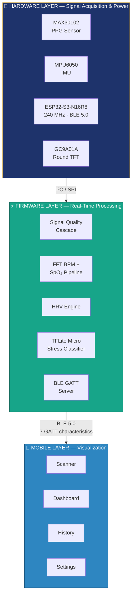
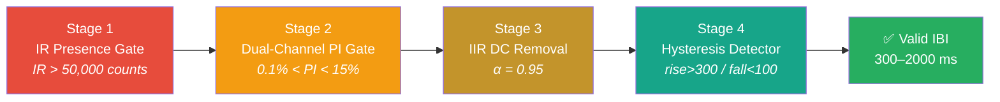
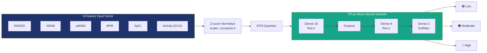
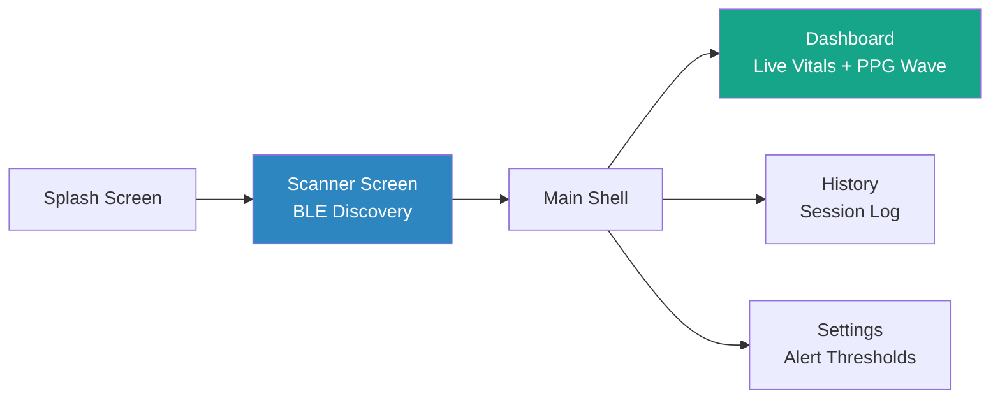

<div align="center">

# 💓 VitalSense

### Compact AI-Powered Finger Oximeter for Comprehensive Vital Tracking

*A self-contained wearable that measures heart rate, SpO₂, HRV, and classifies stress in real time — entirely offline, with zero cloud dependency.*

[](https://www.espressif.com/en/products/socs/esp32-s3)
[](https://www.arduino.cc/)
[](https://flutter.dev/)
[](https://www.tensorflow.org/lite/microcontrollers)
[](https://www.bluetooth.com/)
[](#-license)

**CSE494 Graduation Project · King Salman International University (KSIU) · 2026**
**Author:** Ziad Mohamed Shaker &nbsp;|&nbsp; **Supervisor:** Dr. Samy Abd El-Nabi

</div>

<!-- 📸 Add a hero photo of the assembled device here, e.g.: -->
<!--  -->

---

## 📑 Table of Contents

- [Overview](#-overview)
- [Key Features](#-key-features)
- [System Architecture](#️-system-architecture)
- [Signal Processing Pipeline](#-signal-processing-pipeline)
- [AI Stress Classifier](#-ai-stress-classifier)
- [BLE Communication](#-ble-communication)
- [Mobile Application](#-mobile-application)
- [Hardware](#-hardware)
- [Getting Started](#-getting-started)
- [Results](#-results)
- [Repository Structure](#-repository-structure)
- [Bill of Materials](#-bill-of-materials)
- [Limitations & Future Work](#️-limitations--future-work)
- [References](#-references)
- [Acknowledgments](#-acknowledgments)
- [License](#-license)

---

## 🩺 Overview

Health monitoring today sits at two extremes. **Clinical equipment** is accurate but confined to hospitals. **Consumer wearables** are portable but sacrifice signal quality — deviating from ECG ground truth by up to 22 BPM under mild motion, with no real-time HRV computation and no on-device intelligence.

**VitalSense** closes that gap. It's a finger-clip wearable built around the **ESP32-S3**, **MAX30102** PPG sensor, and **MPU6050** IMU that:

- Measures **heart rate** via frequency-domain FFT analysis (not naive peak-counting)
- Measures **SpO₂** with a quadratic Beer-Lambert calibration and dual-channel signal-quality gate
- Computes **Heart Rate Variability** (RMSSD, SDNN, pNN50) in real time from a rolling RR buffer
- Classifies **stress level** — Low / Moderate / High — using a neural network running **entirely on-device**
- Tracks **activity** (Resting / Walking / Running) via accelerometer
- Streams everything over **BLE 5.0** to a companion Flutter app
- Runs for **7+ hours active**, **40+ hours standby**, on a single 500 mAh Li-ion cell

Total hardware cost: **~$38 USD**. No subscription. No cloud. No compromise.

---

## ✨ Key Features

| Category | Capability |
|---|---|
| 💓 **Heart Rate** | 256-point Hamming-windowed FFT · ±2 BPM accuracy · updates every ~2.56s |
| 🔵 **SpO₂** | Quadratic ratio-of-ratios calibration · dual-channel Perfusion Index gate |
| 📊 **HRV** | RMSSD · SDNN · pNN50 · computed from a 60-interval rolling RR buffer |
| 🧠 **Stress AI** | TFLite Micro INT8 neural network · 3.2 KB · <1 ms inference · 91.67% accuracy |
| 🏃 **Activity** | Step counting + 3-class recognition (Resting/Walking/Running) via MPU6050 |
| 🖥️ **Local Display** | 240×240 round IPS TFT, live vitals, no phone required |
| 📡 **Wireless** | 7 BLE GATT notify characteristics → VitalSense Flutter app |
| 🔋 **Power** | 15s inactivity deep-sleep · RTC-persistent state · 40+ hr standby |
| 🔒 **Privacy** | 100% on-device processing — biometric data never leaves the device |

---

## 🏗️ System Architecture

VitalSense is decomposed into three layers, each with a single responsibility.



| Layer | Responsibility | Makes decisions? |
|---|---|---|
| **Hardware** | Acquire raw signals, deliver power | ❌ No — pure acquisition |
| **Firmware** | Filter, extract features, run ML inference, transmit | ✅ Yes — the computational core |
| **Mobile** | Visualize, log, alert | ❌ No — stateless w.r.t. vital sign computation |

The firmware runs as a **single cooperative loop** on the ESP32-S3's application core — no RTOS. Processing cadences are sample-count-driven (SpO₂ every 100 samples, FFT every 128 samples) rather than timer-interrupt-driven, which keeps the design simple and deterministic.

---

## 🔬 Signal Processing Pipeline

No raw PPG sample reaches beat detection without passing a **4-stage quality cascade**:



### 💓 Heart Rate — FFT-Based BPM

Rather than counting signal peaks (vulnerable to motion artifacts), heart rate is estimated **spectrally**:

1. Accumulate a **256-sample circular buffer** at 50 sps effective (5.12 seconds of signal)
2. Apply a **Hamming window** to taper the buffer edges — eliminates spectral leakage from the hard cut
3. Run a **Discrete Fourier Transform**; the peak-magnitude bin in the 40–200 BPM range = heart rate
4. Update every **128 new samples** (50% overlap) → fresh BPM every ~2.56 s
5. Smooth with a **70/30 IIR filter** (70% previous, 30% new) to suppress single-window anomalies

> Frequency resolution = 50 sps ÷ 256 samples = **0.195 Hz ≈ 11.7 BPM**

### 🔵 SpO₂ — Ratio-of-Ratios Calibration

Exploits the Beer-Lambert law: oxygenated and deoxygenated hemoglobin absorb red (660 nm) and infrared (880 nm) light differently.

```
R = (RMS_AC_red / DC_red) / (RMS_AC_ir / DC_ir)      — over 100-sample (~2 s) windows

SpO₂ (%) = −45.060·R² + 30.354·R + 94.845            — quadratic calibration
                                                         (Maxim AN6291 / Elgendi et al. 2019)
```

A quadratic fit outperforms the naive linear approximation (`SpO₂ ≈ 104 − 17R`) across the full physiological range, especially at lower saturations.

**Signal quality gate:** Both red and IR channels must independently satisfy `0.1% < PI < 15%` (where `PI = AC/DC × 100%`) before any SpO₂ value is accepted. Below range → poor perfusion (cold finger, bad contact). Above range → motion artifact. Either condition holds the last valid reading instead of broadcasting a bad one.

### 📊 Heart Rate Variability (HRV)

From the validated IBI sequence, a **60-interval rolling buffer** feeds three time-domain features:

| Feature | Formula | Physiological Meaning |
|---|---|---|
| **RMSSD** | `√[ Σ(IBIᵢ₊₁ − IBIᵢ)² / (n−1) ]` | Short-term parasympathetic (vagal) activity — most stress-sensitive |
| **SDNN** | `σ(IBI₁, IBI₂, ..., IBIₙ)` | Total HRV power — sympathetic + parasympathetic combined |
| **pNN50** | `count(\|ΔIBIᵢ\| > 50 ms) / (n−1) × 100%` | Percentage-based parasympathetic tone indicator |

Beat detection uses a **hysteresis peak detector**: a beat is confirmed when the AC signal rises above 300 counts and resets only after falling below 100 counts (prevents re-triggering on noise). Any IBI deviating more than ±50% from its predecessor is rejected as a false peak.

---

## 🧠 AI Stress Classifier

### Training Data Collection Protocol

All training data was **personally logged** across a single continuous session using three scientifically validated stress-induction protocols:

| Time | Session | Duration | Protocol |
|---|---|---|---|
| `0:00` | 🟢 **Low Stress** | 40 min | 5 min sit still → 35 min calm breathing / relaxing video. Hand flat on desk, no movement. |
| `+0:40` | ⚪ Rest Break | 20 min | Walk around, get water. Avoid stressful messages/content. |
| `+1:00` | 🟠 **Moderate Stress** | 40 min | 5 min sit still → 35 min reading a hard article and writing a summary. |
| `+1:40` | ⚪ Rest Break | 20 min | Same rest protocol as before. |
| `+2:00` | 🔴 **High Stress** | 30 min | 5 min sit still → **Stroop test** (5 min) → **serial subtraction** (5 min) → **timed exam** (15 min). |

Rest breaks prevent autonomic carryover between sessions. Stroop test, serial subtraction, and mental arithmetic under time pressure are standard, literature-validated acute stress inducers. Raw recordings were augmented with physiologically parameterized synthetic IBI sequences for a more robust training set.

### Feature Vector



> **Why include Activity?** Physical activity suppresses HRV independently of stress. Without encoding activity state, the model would misclassify someone jogging as "High stress" due to naturally low RMSSD during exercise.

### Model Specifications

| Property | Value |
|---|---|
| Architecture | Dense-16 (ReLU) → Dropout → Dense-8 (ReLU) → Dense-3 (SoftMax) |
| Parameters | 275 trainable · 827 total (incl. optimizer state) |
| Model size (INT8) | **3,248 bytes (3.2 KB)** |
| Inference time | **< 1 ms** @ 240 MHz (Xtensa LX7) |
| Tensor arena | 8 KB, allocated in PSRAM |
| Operator kernels | FullyConnected · ReLU · SoftMax · Dequantize (4 total) |
| Inference cadence | Every 60 s, gated on ≥10 valid RR intervals |
| Training framework | TensorFlow 2.18.1 / Keras (`stress.py`) |
| Deployment format | TFLite Micro, INT8 post-training quantized, embedded as C array (`stress_model.h`) |

### Performance

| Metric | Float32 | INT8 (deployed) |
|---|---|---|
| Test Accuracy | 91.67% | **91.25%** |
| Train / Test samples | 816 / 240 | — |
| Accuracy loss from quantization | — | **−0.42 pp** (negligible) |

**Confusion Matrix (test set, 240 samples):**

|  | Predicted Low | Predicted Moderate | Predicted High |
|---|---|---|---|
| **Actual Low** | 77 | 3 | 0 |
| **Actual Moderate** | 5 | 68 | 7 |
| **Actual High** | 0 | 5 | 75 |

Zero confusion between Low and High (the physiologically distinct extremes). The primary confusion is at the Moderate–High boundary, consistent with the literature — these two states share overlapping autonomic signatures.

---

## 📡 BLE Communication

The ESP32-S3 operates as a **BLE 5.0 GATT Peripheral**, advertising as `VitalSense` and exposing one custom service with 7 notify-enabled characteristics:

| Characteristic | Content | Rate | Notes |
|---|---|---|---|
| `BPM` | Smoothed heart rate | ~2.56 s | FFT-derived, IIR-smoothed |
| `Finger Status` | Present / Absent | On change | IR presence gate |
| `SpO₂` | Blood oxygen % | ~2 s | PI-gated, quadratic calibrated |
| `Steps` | Cumulative step count | On change | RTC-persistent across sleep |
| `Activity` | 0=Resting / 1=Walking / 2=Running | On change | From MPU6050 |
| `PPG Stream` | Raw AC waveform | ~40 Hz | Throttled from 50 sps for BLE stability |
| `Stress Label` | Low / Moderate / High | 60 s | TFLite Micro classifier output |

All values are transmitted as **UTF-8 encoded strings** for cross-platform simplicity. Each characteristic includes a `BLE2902` Client Characteristic Configuration Descriptor (CCCD) to enable notifications.

**Power-aware connectivity:** an inactivity watchdog monitors finger contact, motion, and BLE connection state. After **15 seconds** of full inactivity, the device enters deep sleep (~0.5 mA draw), waking every **2 seconds** to poll for finger placement before deciding whether to resume or sleep again. Step count and boot count persist across sleep cycles via `RTC_DATA_ATTR`.

---

## 📱 Mobile Application

**VitalSense** — a Flutter 3.x / Dart 3.x app targeting Android and iOS.



- **State management:** Lightweight `ValueNotifier` / `ValueListenableBuilder` pattern — no BLoC/Riverpod/Provider overhead needed for this state cardinality
- **PPG rendering:** Custom `SparklinePainter` (`CustomPainter`) renders the live waveform at ~40 Hz with `shouldRepaint` optimization
- **BLE stack:** `flutter_blue_plus` — auto-discovers all 7 characteristics, subscribes with a 300 ms stagger to avoid GATT congestion
- **Alerts:** Haptic feedback (`Timer.periodic`, 2 s interval) while BPM is outside user-configured bounds; visual color transitions for low SpO₂
- **Persistence:** `SharedPreferences` for settings; in-memory circular buffer (100 entries) for session history
- **End-to-end latency:** sensor event → screen pixel in **25–35 ms**

<!-- 📸 Add app screenshots here, e.g.: -->
<!-- <p align="center">
  
  
  
</p> -->

---

## 🔧 Hardware

<!-- 📸 Add device/PCB photos here, e.g.: -->
<!--  -->

### Components

| Component | Role | Key Specs |
|---|---|---|
| **ESP32-S3-N16R8** | Microcontroller | Dual-core Xtensa LX7 @ 240 MHz · 16 MB Flash · 8 MB PSRAM · BLE 5.0 · ~30 mA active / ~7 µA deep sleep |
| **MAX30102** | PPG Sensor | Red (660 nm) + IR (880 nm) LEDs · 18-bit ADC · I²C @ 0x57, 400 kHz · 32-sample FIFO |
| **MPU6050** | IMU | 3-axis accelerometer (gyro powered down) · I²C @ 0x68 · ±2g range · 100 Hz ODR |
| **GC9A01A** | Display | 240×240 round IPS TFT · 1.28" · SPI @ 40 MHz · ~180° viewing angle |
| **TP4056 (HW-107)** | Battery Charger | USB-C · 1A charge current · DW01A overcharge/overdischarge protection |
| **AMS1117-3.3V** | Voltage Regulator | Low-noise LDO (SOT-223) — chosen over switching regulators to avoid coupling noise into the MAX30102's analog front end |
| **Li-ion Battery** | Power | 3.7V nominal, 500 mAh |

### Power Chain

```
USB-C (5V) → TP4056 CC/CV → 3.7V Li-ion → Power Switch → AMS1117-3.3V LDO → 3.3V digital rail → all loads
```

### PCB

| Spec | Value |
|---|---|
| Layers | 2 (signal + power) |
| Substrate | FR4, 1.6 mm |
| Copper weight | 1 oz (35 µm) |
| Dimensions | ~75 × 75 mm |
| Surface finish | HASL |
| I²C pull-ups | 4.7 kΩ (valid range: 1.1–7.07 kΩ @ 400 kHz fast mode) |
| Decoupling | 2× 10 µF (AMS1117 input + output) |

---

## 🚀 Getting Started

### Prerequisites

- [Arduino IDE](https://www.arduino.cc/en/software) or PlatformIO with **ESP32-S3** board support
- [Flutter SDK](https://flutter.dev/docs/get-started/install) 3.x
- Python 3.9+ with `tensorflow`, `numpy`, `scikit-learn` (for retraining the model)

### 1️⃣ Flash the Firmware

```bash
# Open HealthMonitor.ino in Arduino IDE
# Board: ESP32S3 Dev Module
# Flash Size: 16MB | PSRAM: OPI PSRAM

# Required libraries:
#   - SparkFun MAX3010x Pulse and Proximity Sensor Library
#   - MPU6050_light
#   - Adafruit GC9A01A
#   - TensorFlow Lite for Microcontrollers (ESP32)

# Select port and click Upload
```

### 2️⃣ Run the Mobile App

```bash
git clone <your-repo-url>
cd vitalsense-app
flutter pub get
flutter run
```

### 3️⃣ (Optional) Retrain the Stress Classifier

```bash
cd ml/
pip install tensorflow numpy scikit-learn
python stress.py
# Outputs: stress_model.h, scaler_constants.h
# Copy both into the firmware directory and re-flash
```

---

## 📊 Results

Evaluated against a clinical-grade reference oximeter across 5 healthy adult volunteers under resting, post-exercise, and controlled-breathing conditions (≥30 paired readings per condition):

| Metric | Result |
|---|---|
| BPM MAE (resting) | 1.8 – 2.4 BPM |
| BPM MAE (post-exercise) | 3.1 – 4.2 BPM |
| SpO₂ MAE (resting) | 1.2 – 1.8% |
| Step count MAE | < 5% (trials ≥ 100 steps) |
| Activity classification accuracy | > 90% |
| HRV feature error vs. Python reference | < 2% |
| BLE notification latency | 8 – 15 ms |
| Packet delivery ratio (PPG @ 1m) | > 97% |
| Active battery life | ~7 hours (65–75 mA draw) |
| Deep-sleep standby | 40+ hours (~0.5 mA draw) |

> ⚠️ **Honest limitation:** SpO₂ validation was constrained to healthy volunteers in room air (96–99% range). The clinically critical 85–94% desaturation range has **not** been validated — this requires an IRB-approved controlled study (see [Future Work](#️-limitations--future-work)).

---

## 📁 Repository Structure

```
vitalsense/
├── firmware/
│   ├── HealthMonitor.ino        # Main firmware — signal processing, BLE, display
│   ├── stress_model.h           # TFLite Micro INT8 model (C array)
│   └── scaler_constants.h       # Z-score normalization constants
├── app/                         # Flutter mobile application
│   ├── lib/
│   │   ├── screens/
│   │   │   ├── scanner_screen.dart
│   │   │   ├── dashboard_page.dart
│   │   │   ├── history_page.dart
│   │   │   └── settings_page.dart
│   │   └── widgets/
│   │       └── custom_painters.dart   # SparklinePainter for PPG waveform
│   └── pubspec.yaml
├── ml/
│   ├── stress.py                # Training pipeline (TensorFlow/Keras)
│   └── data/                    # Logged RR-interval sessions
├── hardware/
│   ├── schematic/                # Circuit schematic
│   └── pcb/                      # Gerbers, BOM
└── docs/
    └── images/                   # Photos, screenshots, diagrams
```

> *Adjust folder names above to match your actual repository layout.*

---

## 💰 Bill of Materials

| Component | Qty | Unit Cost (EGP) |
|---|---|---|
| ESP32-S3-N16R8 | 1 | 550 |
| MAX30102 (GY-MAX30102) | 1 | 250 |
| MPU6050 (GY-521) | 1 | 300 |
| GC9A01A Round TFT | 1 | 350 |
| TP4056 HW-107 Module | 1 | 20 |
| AMS1117-3.3V (SOT-223) | 1 | 15 |
| 3.7V Li-ion 500mAh | 1 | 80 |
| Passives (resistors, caps, switch) | — | 15 |
| PCB fabrication (5 pcs) | 5 | 50 |
| **Total** | | **≈ 1,880 EGP (~$38 USD)** |

---

## ⚠️ Limitations & Future Work

**Known limitations:**
- SpO₂ calibration unvalidated below 94% saturation (ethical constraint of inducing hypoxemia in healthy volunteers)
- Validated on 5 healthy adults only — insufficient for skin-tone diversity claims (melanin absorption at 660 nm is known to affect PPG accuracy)
- Sustained continuous motion causes extended PI-gate suppression periods
- PCB lacks a continuous back-layer ground pour (potential EMC vulnerability)

**Roadmap:**
- [ ] Full back-layer ground pour + via stitching (PCB rev 2)
- [ ] MAX17048 fuel gauge for real battery percentage
- [ ] Interrupt-driven MAX30102 FIFO reading (currently polled)
- [ ] MPU6050 DMP-based hardware step counting
- [ ] OTA firmware updates over BLE
- [ ] IRB-approved controlled desaturation study (80–100% SpO₂ range)
- [ ] 4-wavelength sensor (MAX86916, green + amber LEDs) for equitable accuracy across skin tones
- [ ] Apple Health / Google Fit integration
- [ ] SQLite-backed persistent history (`sqflite`)

---

## 📚 References

Key sources underpinning the methodology (full list in the project report):

- Allen, J. (2007). *Photoplethysmography and its application in clinical physiological measurement.* Physiological Measurement, 28(3).
- Aoyagi, T. (2003). *Pulse oximetry: its invention, theory, and future.* Journal of Anesthesia, 17(4).
- Dunn, J., Runge, R., & Snyder, M. (2018). *Wearables and the medical revolution.* Personalized Medicine, 15(5).
- Shaffer, F., & Ginsberg, J.P. (2017). *An overview of heart rate variability metrics and norms.* Frontiers in Public Health, 5.
- Task Force of ESC/NASPE (1996). *Heart rate variability: standards of measurement, physiological interpretation, and clinical use.* Circulation, 93(5).
- Warden, P., & Situnayake, D. (2019). *TinyML: Machine learning with TensorFlow Lite on Arduino and ultra-low-power microcontrollers.* O'Reilly Media.
- Sjoding, M.W. et al. (2020). *Racial bias in pulse oximetry measurement.* New England Journal of Medicine, 383(25).

---

## 👥 Acknowledgments

- **Supervisor:** Dr. Samy Abd El-Nabi — Associate Professor, Faculty of Computer Science and Engineering, KSIU
- **Institution:** King Salman International University, El-Tor Campus
- Built on the shoulders of the SparkFun MAX3010x library, TensorFlow Lite for Microcontrollers, and the flutter_blue_plus community package

---

## 📄 License

This project was developed as an academic graduation project (CSE494, KSIU 2026). Feel free to add a `LICENSE` file — [MIT](https://choosealicense.com/licenses/mit/) is a common, permissive choice for student open-source projects if you'd like others to freely use, modify, and distribute this work.

---

<div align="center">

**⭐ If this project helped you, consider starring the repo!**

Made with 💓 and way too much coffee — Ziad Mohamed Shaker, 2026

</div>
